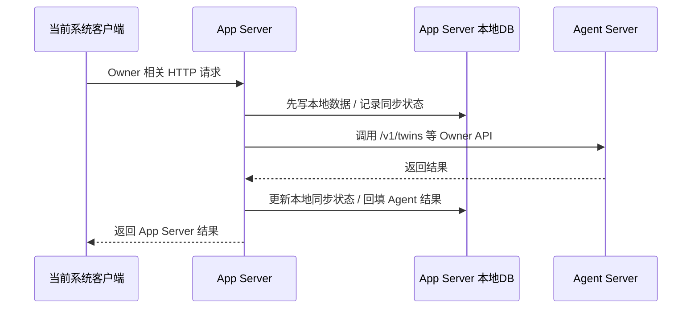
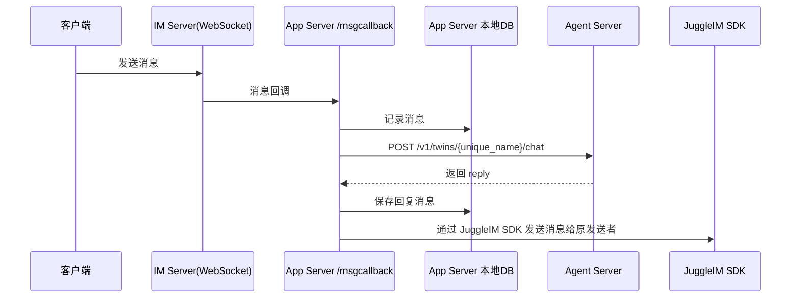

# api.md 调用逻辑与流程

## 结论

`api.md` 是 Agent Server 的权威契约。当前项目是 App Server，所以这里不直接复刻 Agent Server，而是做一层本地业务封装：

- Owner 侧接口由 App Server 提供给当前系统使用
- Customer 侧只有 `/v1/twins/{unique_name}/chat` 这一条会出现在 `/msgcallback` 的回调链路里
- App Server 的数据策略是 `local-first`：先落盘，再同步 Agent Server
- App Server 需要保存一份 Agent Server 的核心业务投影，包括分身、素材、版本、任务、评估，以及 customer 热路径所需的消息记录

## 现状对照

当前代码里相关入口很薄：

- `routers/router.go` 只有 `/jim/aibots/*` 和 `/botmsgs/msgcallback`
- `services/aibotservice.go` 只做了 bot 的增删改查
- `storages/dbs/aibotdao.go` 只落了 `aibots` 一张表
- `apis/msgcallback.go` 目前只是读一下请求体然后返回成功

这说明现阶段缺的不是 HTTP 入口，而是：

1. Agent Server API 的本地包装层
2. 本地数据模型的扩展
3. `/msgcallback` 的业务处理链路
4. 本地写入与 Agent Server 同步之间的状态管理

## 调用流程

### Owner 链路



Owner 侧的关键规则：

- 本地写成功后再同步 Agent Server
- 本地成功、远端失败时，不能回滚本地已落盘的数据
- 需要记录 `sync_status`、`sync_error`、`last_synced_at` 一类的状态
- `X-Owner-Id` 由 App Server 当前登录态映射出来，再透传给 Agent Server

### Customer 链路



Customer 侧的关键规则：

- 只有 `/v1/twins/{unique_name}/chat` 这一条走回调链路
- 回调里收到消息后，App Server 先记本地会话，再调 Agent Server
- Agent Server 返回后，由 App Server 负责通过 JuggleIM SDK 把结果发回消息发送者
- 业务异常不要直接暴露给终端用户，必须走安全兜底回复

### `/msgcallback` 请求体结构

`apis/msgcallback.go` 需要把 IM 回调原始 body 当成业务输入保存并解析。当前确认的请求体结构如下：

```json
{
  "event_type": "message",
  "timestamp": 1713456000000,
  "payload": [
    {
      "platform": "iOS",
      "sender": "userid1",
      "receiver": "userid2",
      "conver_type": 1,
      "msg_type": "text",
      "msg_content": "Hello, world!",
      "mention_info": {
        "mention_type": "mention_all",
        "target_user_ids": ["userid1", "userid2"]
      },
      "msg_id": "123",
      "msg_time": 1718980832156
    }
  ]
}
```

字段含义：

- `event_type`：事件类型，取值包括 `message`、`online`、`offline`
- `timestamp`：回调事件时间，毫秒时间戳
- `payload`：消息数组，可能一次回调包含多条消息
- `payload[].platform`：客户端平台，如 `iOS`、`Android`、`Web`、`PC`、`Server`
- `payload[].sender`：发送者 uid，映射为 Agent Server 的 `customer_id`
- `payload[].receiver`：接收者 uid，映射为 bot id，再查本地分身得到 `unique_name`
- `payload[].conver_type`：会话类型，`1` 私聊、`2` 群聊、`3` 聊天室
- `payload[].msg_type`：消息类型，MVP 只处理 `text`
- `payload[].msg_content`：消息正文，作为 `/v1/twins/{unique_name}/chat` 的 `message`
- `payload[].mention_info`：提及信息，群聊场景用于判断是否需要触发 bot
- `payload[].msg_id`：IM 消息 id，用于幂等和本地消息记录
- `payload[].msg_time`：消息产生时间，毫秒时间戳

处理规则：

1. 先保留原始 body，便于审计和重放
2. 仅处理 `event_type = message`
3. 遍历 `payload[]`，逐条处理消息
4. MVP 阶段只处理 `msg_type = text`
5. 将 `payload[].sender` 作为 `customer_id`
6. 将 `payload[].receiver` 先按本地 bot id 查询，再映射成 `unique_name`
7. 将 `payload[].msg_content` 作为 chat message
8. 使用 `payload[].msg_id` 做幂等，避免重复回调导致重复回复
9. 再调用 `/v1/twins/{unique_name}/chat`

## 数据落盘策略

本地库需要保存一份 Agent Server 的业务投影，建议按资源拆分：

- `twin`
- `material`
- `version`
- `job`
- `evaluation`
- `message`
- `sync_log`
- `tombstone`

其中两个规则必须明确：

1. `unique_name` 不可复用，需要 tombstone
2. App Server 永远是本地事实来源，Agent Server 只是远端执行与对齐目标

## App Server 需要新增的能力

- Agent Server HTTP Client 包装
- Owner 侧的本地写入 + 远端同步服务
- Customer 回调解析与 reply 下发
- 任务/同步状态查询
- 版本、评估、消息的本地查询接口

## 待确认/默认假设

- `/msgcallback` 已按当前确认的 `event_type/timestamp/payload[]` 结构规划；后续只需用真实样例校准边界字段
- Agent Server 的 base URL、超时、重试、鉴权头需要进配置
- `bot_id` 是否继续保留，只作为兼容字段，还是直接切成 `unique_name`，需要在落库方案里统一
- SSE 能力先保留协议层支持，但 `msgcallback` 热路径优先实现 JSON 一次性回复
